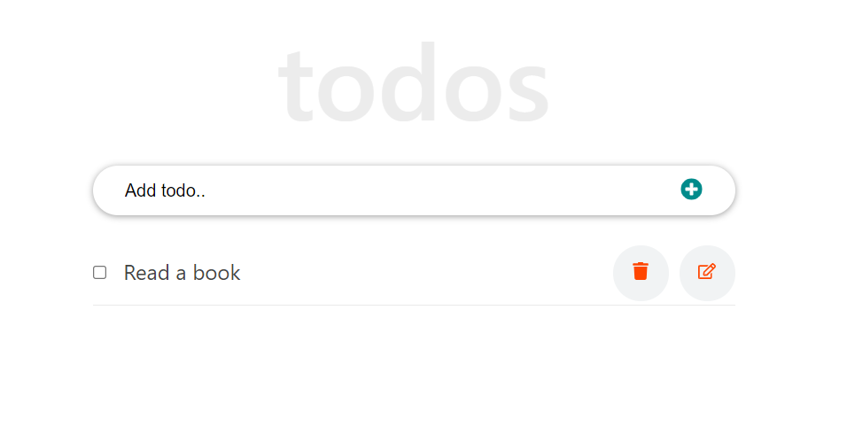
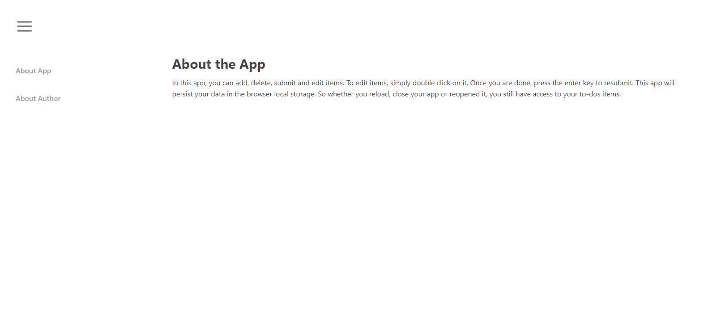

# A To-do app developed using React.js

In this app, you can add, delete, submit and edit items. To edit items,
simply double click on it. Once you are done, press the enter key 
to resubmit. This app will persist your data in the browser local 
storage. So whether you reload, close your app or reopened it,
you still have access to your to-dos items.

# Home Page

 
 
# About Us Page

